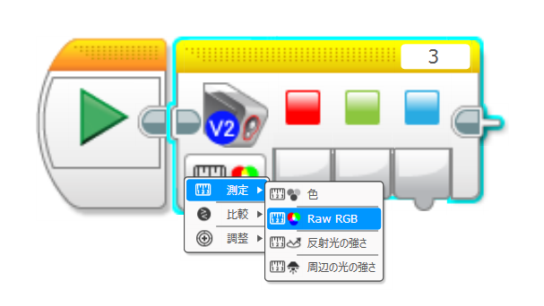
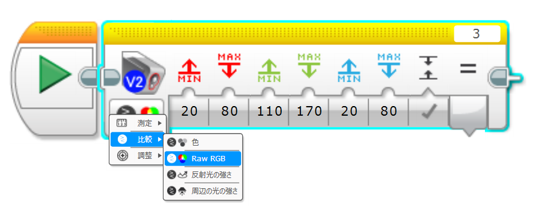
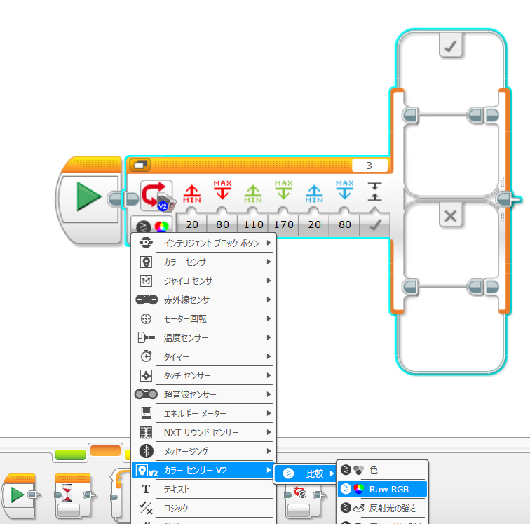
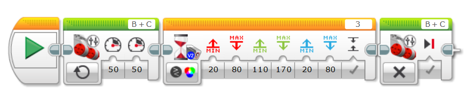

# ColorSensor V2 - EV3 Custom Programming Block
## 概要
ColorSensor V2 は、LEGO MINDSTORMS EV3 向けのカスタムプログラミングブロックです。EV3標準のカラーセンサーでは扱えない「生のRGBデータ取得」や「RGBの範囲による色検出」が可能で、色認識の幅を大きく広げます。

本ブロックでは、以下の2つのモードをサポートしています。

### Raw RGB 測定モード
センサーから取得した 生のRGB値（Red・Green・Blue） を直接出力します。

📷 使用イメージ：

### Raw RGB 比較モード
指定したRGBの範囲と現在のセンサー値を比較し、条件に一致するかどうかを 真偽値（true / false） で出力します。
スイッチブロックやループブロックの条件として使用でき、色に応じた分岐処理が簡単に作れます。

📷 使用イメージ：

## 特徴
✅ RawRGBの取得

EV3標準ブロックでは取得できない生のRGB値を読み取れます。

✅ RGBの範囲による色判定

色の「微妙な違い」まで判定可能。条件付きの色検出に最適です。

✅ 条件ブロックに対応

スイッチブロックやループブロックで色を使った分岐処理ができます。

## インストール方法
- ColorSensorV2.ev3b をダウンロードします
- EV3ソフトウェアを開き、
　[ツール] > [ブロック インポート ウィザード] を選択します
- ダウンロードした .ev3b ファイルを読み込みます
- EV3ソフトウェアを再起動します
- 追加されたブロックをドラッグ＆ドロップで使用できます

## 使用例
以下は「前進し、緑色を検出したら停止する」プログラムの例です。

📷 プログラム例：

